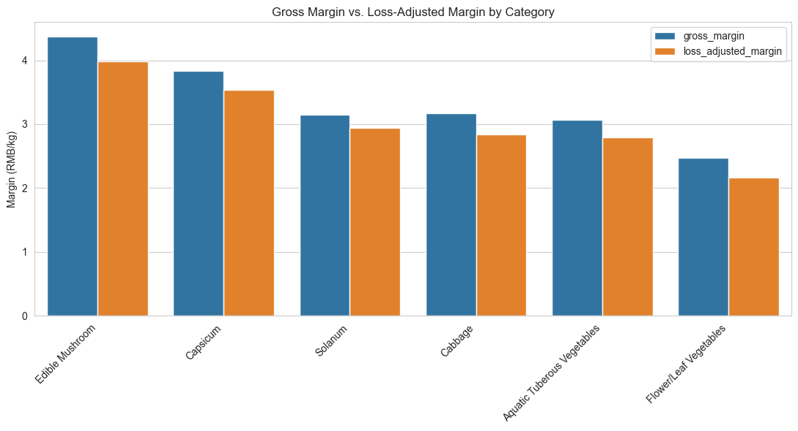
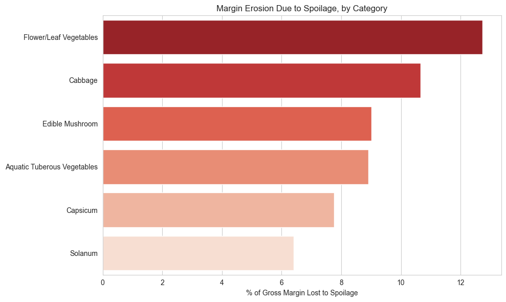
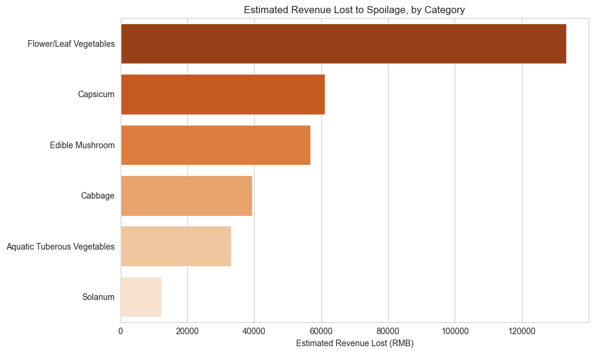
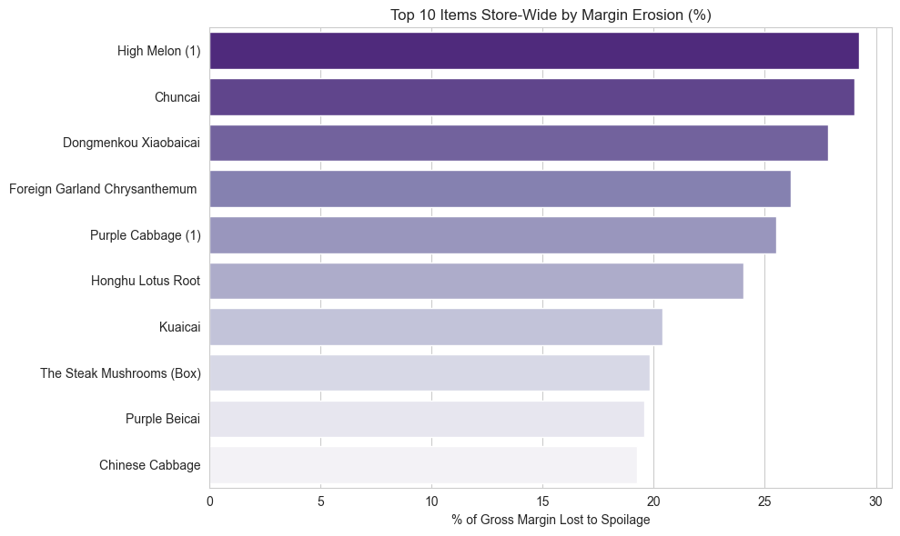

# Supermarket Spoilage & Margin Analysis

SQL + Python analysis identifying which supermarket vegetable categories 
and items lose the most profit to spoilage, with actionable recommendations 
for order volume, storage, and pricing.

## Business Question

Which vegetable categories have the highest loss (spoilage) rates relative 
to their profit margin, and where should the store adjust order quantities, 
pricing, or shelf life management to reduce waste-driven losses?

## Summary

Flower/Leaf Vegetables shows the highest margin erosion from spoilage 
(12.73%) and the highest estimated revenue lost to spoilage of any category 
(¥133,327.63) — driven primarily by Chuncai, Dongmenkou Xiaobaicai, and 
Foreign Garland Chrysanthemum. Additionally, two items were found selling 
below wholesale cost entirely independent of spoilage, pointing to a 
separate pricing issue worth immediate review.

## Data Source

[Supermarket Sales Data](https://www.kaggle.com/datasets/yapwh1208/supermarket-sales-data) 
— vegetable sales, wholesale pricing, and loss rate data from a Chinese 
supermarket, covering July 2020 to June 2023.

## Tools Used

- **SQL** (DuckDB) — data analysis, multi-table joins, window functions, CTEs
- **Python** (pandas) — data cleaning and quality checks
- **matplotlib / seaborn** — visualization

## Key Findings

- **Flower/Leaf Vegetables** has the highest loss-adjusted margin erosion at 
  **12.73%**, meaning nearly 13% of its potential profit is lost to spoilage 
  — and the highest estimated revenue lost to spoilage of any category, at 
  approximately **¥133,328**.
- Within this category, **Chuncai (29.03%)**, **Dongmenkou Xiaobaicai (27.84%)**, 
  and **Foreign Garland Chrysanthemum (26.16%)** show the steepest margin 
  erosion, making them the top candidates for reduced order volume or 
  improved storage handling.
- Store-wide, the single largest erosion outlier is **High Melon** 
  (Aquatic Tuberous Vegetables, 29.25% erosion) — showing that high-erosion 
  items exist outside the worst-performing category too, and are worth 
  monitoring independently of category-level averages.
- Two items — **Hongshan Gift Box** and **Hongshan Shoutidai** — were found 
  selling below wholesale cost, losing **¥124.73/kg** and **¥58.67/kg** 
  respectively on every sale. This is a pricing issue unrelated to spoilage 
  (both are low-volume, 3 transactions each) but represents a guaranteed 
  loss worth flagging for review.

## Visualizations

### Gross Margin vs. Loss-Adjusted Margin by Category

### Margin Erosion Due to Spoilage, by Category

### Estimated Revenue Lost to Spoilage, by Category

### Top 10 Items — [Worst Category] Drill-Down
.png)

### Top 10 Items Store-Wide by Margin Erosion

## Methodology & Key Assumptions

- **Margin** calculated using the wholesale price recorded on the same date 
  as each sale, as a proxy for cost basis — a reasonable approximation given 
  the fast turnover typical of fresh produce, though not an exact 
  cost-of-goods-sold calculation.
- **Loss-adjusted margin** = gross margin × (1 − loss rate), representing 
  real profit after accounting for spoilage.
- Two items (Haixian Mushroom variants) were excluded from all loss-rate-based 
  rankings and aggregations due to an implausible 0% loss rate at very high 
  transaction volume, likely reflecting missing/unrecorded data rather than 
  genuine zero spoilage.
- "Broccoli" had inconsistent category classification across two SKUs in the 
  source data; both were standardized to "Cabbage" for consistent 
  category-level aggregation.
- Loss Rate (%) is treated as a given, pre-calculated input from the source 
  data — it cannot be independently verified, as no purchase-quantity data 
  is available in this dataset.

Full data cleaning steps, decisions, and SQL queries are documented in the notebook.

## Project Structure
notebook/ → Full analysis notebook (SQL + Python)
images/ → Exported chart visualizations
memo/ → Business memo (PDF) with findings and recommendations

## Full Analysis

See the [notebook](notebook/supermarket-spoilage-margin-analysis.ipynb) for 
complete data cleaning steps, SQL queries, and methodology.

## Business Memo

See [business_memo.pdf](memo/business_memo.pdf) for the full write-up, 
findings, and recommendations.
